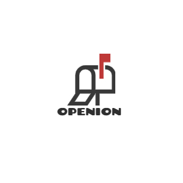

# Opeion
Open Opinion
- サイト概要
- サイトテーマ
- テーマを選んだ理由
- ターゲットユーザ
- 主な利用シーン
- ER図
- チャレンジ要素一覧
- 開発環境
- 使用素材

## サイト概要
日常の困ったことをシェアするご意見箱SNSです。
みんなが困っていることを投稿、同調(いいね)したり、コメントしたりして議論しあおう。
解決策を知っている人はコメントで教えてあげよう。

### サイトテーマ
みんなの困った声を共有し、可視化する。

### テーマを選んだ理由
大なり小なり、みんな日常で困ったことを抱えています。

そんな困った声を共有することで解決できることもあるかもしれません。
また、自分だけの悩みだと思っていたことはもしかしたら他の人も困っていることかもしれません。

もしかしたら、さらにみんなの声が集まれば、社会の制度を変える何かのきっかけになるかもしれない。

本サイトではみんなの困った声を気軽に投稿し、可視化することで問題解決の何か糸口になればと思い作成しました。

ゆくゆくはランキングの上位のお悩みを然るべき機関のご意見箱に投稿して、
実際に社会の制度を変えるような動きができるサービスになればと思っています。

### ターゲットユーザ
日常のちょっとした困ったことを抱えている人。
制度等社会の大きな課題にぶつかっている人。
同じような悩みを誰かと共感したい人。

### 主な利用シーン
ゴミ捨て場のゴミが散乱していて困っている時。
通学路の歩道が狭くて危ない時。
起業をしたいが役に立つ制度が知りたい時、調べる方法を知りたい時。
お金がなくて学校に通えない時。

## ER図

## チャレンジ要素一覧
https://docs.google.com/spreadsheets/d/1OLe4_YLulDvtOMI3M_xQPB-XfJHu7gri31EvCHPVgMI/edit#gid=0

## 開発環境
- OS：Linux(CentOS)
- 言語：HTML,CSS,JavaScript,Ruby,SQL
- フレームワーク：Ruby on Rails
- JSライブラリ：jQuery
- IDE：Cloud9

## 使用素材
- Font Awesome
https://fontawesome.com/
- Unsplash
https://unsplash.com/
- DesignEvo
https://www.designevo.com/